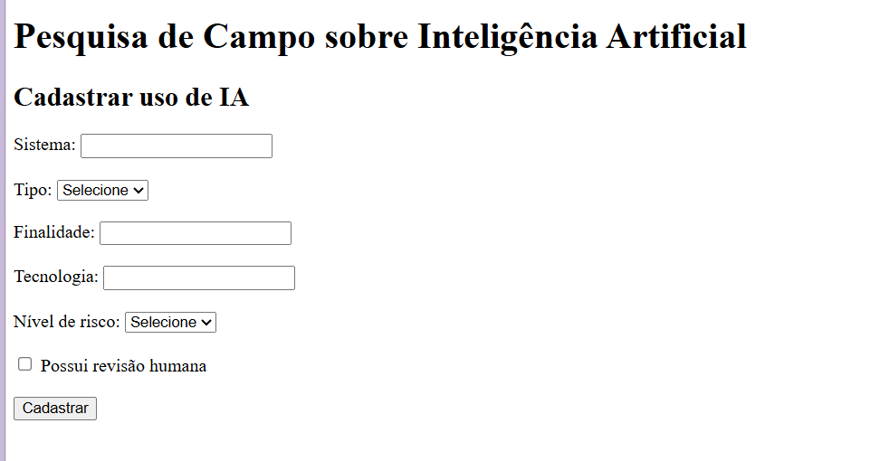
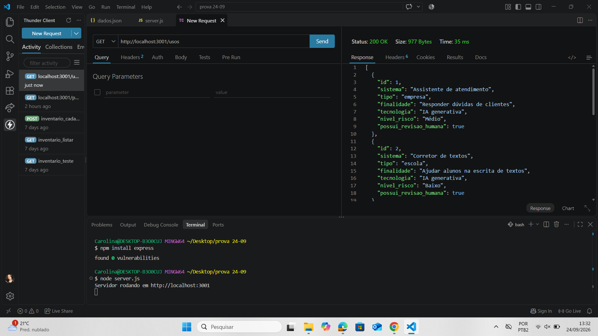
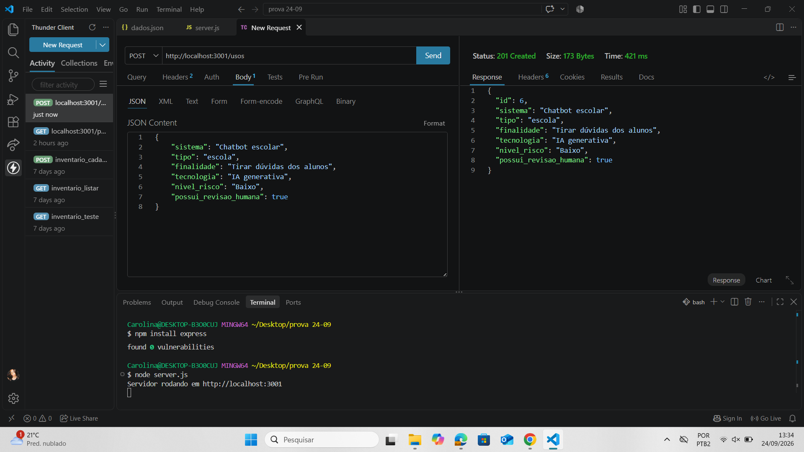
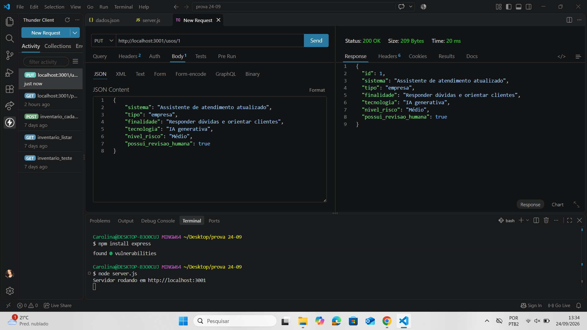
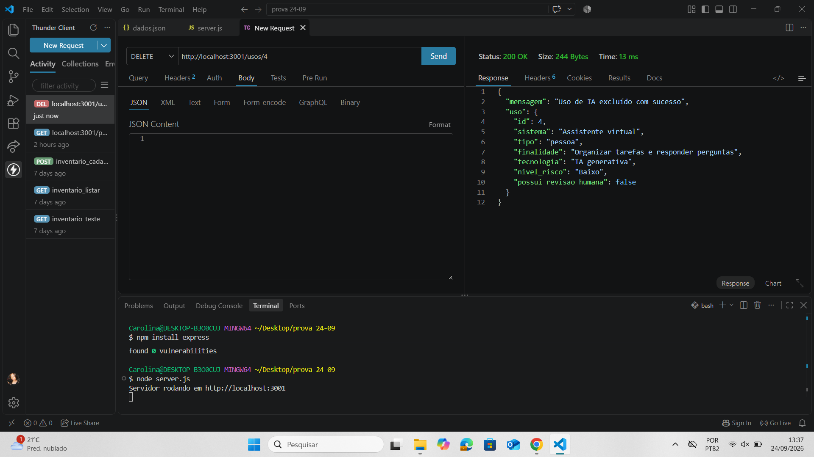

# Pesquisa de Campo - Banco de Usos de IA

Exemplo simples de back-end para cadastrar e consultar alguns usos de Inteligência Artificial usando JSON.

## Tecnologias

* **Node.js**
* **JavaScript**
* **Express**
* **VS Code**
* **Thunder Client**
* **HTML**
* **JSON**

## Como executar

### 1. Clone este repositório

Abra o repositório no GitHub e faça o clone para o seu computador.

### 2. Abra no VS Code

Abra a pasta do projeto no **Visual Studio Code**.

### 3. Instale as dependências

No terminal, digite:

```bash
npm install
```

### 4. Inicie o servidor

```bash
node server.js
```

O servidor ficará disponível em:

```text
http://localhost:3001
```

## Testando a API

Os testes podem ser feitos pelo **Thunder Client**.

### GET — obter

```text
GET http://localhost:3001/ia
```

## Print dos testes

### Index


### Obter


### Post


### Colocar


### Excluir

